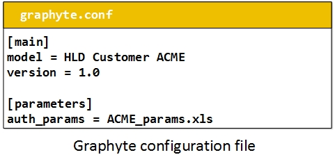

# Configuration File

Graphyte requires a configuration file where the model owner will add some mandatory settings and others that are optional:

| Section | Setting | Mandatory/Optional | Example | Description |
|:------- |:------- |:------- |:------- |:------- |
| **[main]** | model | mandatory | model = HLD Customer ACME | Global name of the model. It will appear in all modules. |
| **[main]** | version | mandatory | version = 1.0 | Version of the model. |
| **[main]** | changes_file | optional | changes_file = CHANGES.txt | Text file with log of changes for the model. It will show in "Changes" tab in the navigation menu. |
| **[parameters]** | auth_params | optional | auth_params = ACME_params.xls | Worksheet with the list of authorised parameters for template validation. |
| **[layout]** | diagram_order | optional | diagram_order = Overview.svg,Sequence.uml,Architecture Components.uml,Service.yang | Desired order for the modules in the navigation menu. Use exact diagram filenames (spaces allowed). Comma separated. |
| **[layout]** | diagram_ignore_list | optional | diagram_ignore_list = topology.svg,l3vpn.yang | List of diagram files to skip processing into modules. Use exact diagram filenames (spaces allowed). Comma separated. |
| **[layout]** | pyang_uml_no | optional | pyang_uml_no = annotation,import,typedef | PYANG options to skip when converting YANG into UML. (Allowed values: uses,leafref,identity,identityref,typedef,annotation,import,circles,stereotypes.) |
| **[confluence]** | enabled | optional | enabled = True | Upload model to confluence instance. |
| **[confluence]** | conf_base_url | mandatory when confluence enabled = True | conf_base_url = https://scdp.cisco.com/conf | Confluence Server Base URL |
| **[confluence]** | parent_page_url | mandatory when confluence enabled = True | parent_page_url = https://scdp.cisco.com/conf/display/TTD/ | URL of confluence page below which the model should be uploaded. |

