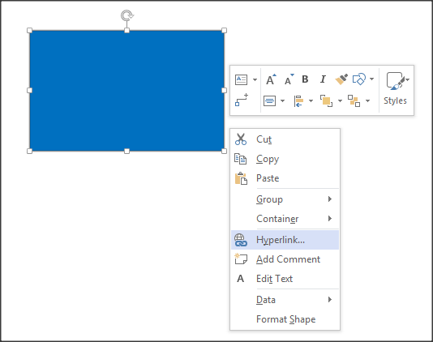
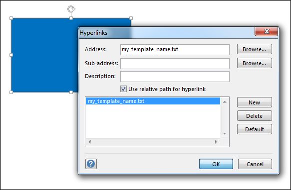

# Diagrams

Graphyte supports two types of input diagrams:

- **SVG**: Scalable Vector Graphics files (with extension **.svg**).
- **UML**: Unified Modeling Language UML files (with extension **.uml**)

Both types of diagram specifications are text-based and require a rendering engine to create the resulting graphics. Below you can see a couple of examples of the source text file and the rendered version for both types of diagrams:

## Modules and diagram files

We saw earlier that a graphyte model is formed by several modules. The modules present in a model have a 1 to 1 correspondence with the diagrams provided as input, i.e. for each input diagram (file with extension **.svg** or **.uml**), graphyte will create one dedicated module in the model.

In order to name each module, graphyte will use the corresponding input diagrams filename. It will strip the extension and use the remaining part as name for the module.

For example, for a diagram filename "Architecture Components.svg", the resulting module will be named "Architecture Components".

## Linking input diagrams and templates

If everything goes as planned, graphyte will produce a series of web documents embedding both diagrams and templates. When the user selects active shapes of the diagram, the corresponding templates will be triggered and loaded into the viewer.

For this to be possible, there must be some association linking a particular element in a diagram to one of the multiple input templates. Graphyte uses the **Hyperlink** field on diagram shapes to establish that association between shape and template. The user is required to add a hyperlink to each shape with the name of the target template to be loaded on a mouse-click event.

## Supported Link Types

Graphyte supports 3 types of links in diagrams:

- Links to templates

Used to show the contents of a template in the viewer when clicking on a particular shape. In order to achieve this, in your diagram, add a link to the shape. Add the name of the template in the href field (the path is not required). No additional tags are required.

    E.g.: href="my_template.txt"

 
- Links to other modules in the model

This allows the user to, by clicking on a shape in one module, load another one of the modules in the same model. In order to define this type of link, we must use the tag "mod:".

E.g.: Consider the following graphyte model called "Project ACME", which has 3 diagrams, that will generate 3 modules:

    Model = "Project ACME"

    Module 1 = foo.svg

    Module 2 = bar.svg

    Module 3 = baz.uml

In order to go from Module 1 to Module 2, the user could rely on the embedded navigation menu that graphyte adds to the model. But it is also possible to add a link to a shape in foo.svg, that will take the user directly to Module 2. In order to achieve this, the model owner can add a link to a shape in foo.svg with the content:

    href="mod:bar.svg"

(It is also possible to leave the extension out, as in **href="mod:bar"**).

The same applies for uml diagrams. However there is one thing the model owner needs to take care of. Plantuml syntax for hyperlinks does not allow spaces, while graphyte does allow spaces in diagram filenames. So in graphyte we could have a diagram file called "foo bar.uml". In order to link to that module from a plantuml diagram, model owner must remember to replace spaces (" ") by their percent encoding ("%20") sign: "foo%20bar.uml". This is not required for SVG diagrams.

- Links to any external URL

In order for graphyte not to interpret href field contents, the model owner must add it as a literal hyperlink with the tag "lit:".

This will be useful to link to URLs that graphyte should not process further.

    E.g.: href="lit:https://www.cisco.com/"

When clicking on the shape it will load the URL [https://www.cisco.com](https://www.cisco.com) in the browser.

## SVG Diagrams

SVG files are text-based specifications of two-dimensional graphics, written following an XML-based structure. Rendering of most SVG graphics is supported by the majority of mainstream modern browsers (**W3C**). Other advanced features present in complex SVG elements, like for example "foreign-object" elements are not supported in the HTML5 <svg> element. Test HTML support for your diagrams passing them to the graphyte tool.

The creation of SVG graphics is usually achieved by using a graphic editor. One can simply draw lines and shapes and once ready export the work to an SVG file. We will explain how to do this using several editors widely known and used:

- [Visio](https://en.wikipedia.org/wiki/Microsoft_Visio), a widely used software from Microsoft.
- [Draw.io](https://www.draw.io/), an online flowchart editor.
- [Inkscape](https://inkscape.org/), a free vector graphics editor.

In these sections we will first create a simple shape, then add the link for a hypothetical template file, and lastly export to SVG format, compatible with graphyte. Creating a model will come down to repeat the procedure for each shape/template of each diagram.

### Creating SVG diagrams with Microsoft Visio

This might be the most familiar solution in many cases, since it comes with simple to use stencil collections for any kind of diagram, which can also be extended downloading new stencils from online sources.

Open Visio and draw any shape or stencil you want. For example in the top Ribbon - Tools select the rectangle and draw a rectangle in your canvas.

Right-click on your shape and select "Hyperlink...".

Edit the field "Address:" and add the name of the TXT, CSV or XML template you would like to link to this shape. **Only the filename** is required, no need for the full path to the template. When done click OK.

Repeat the steps above until your diagram is ready.

(see also: [Supported Link Types](#Supported-Link-Types) section)

In order to export the diagram to SVG from Visio click on **File -> Export -> Change File Type-> SVG** and choose the name of your SVG file. This will become the name of the module, and that the file must keep its **.svg** extension.

> **Important**: Filenames must be **unique** per model. Graphyte will crawl through all the input files looking for every linked filename until it finds the first match.

### Creating SVG diagrams with Draw.io

Draw.io is a great online graph editor from JGraph Ltd. It has an intuitive and rich interface to create all kinds of diagrams and flow charts.

Visit [Draw.io](www.draw.io) and select "Create New Diagram" from the splash screen. If you had previously created a draw.io diagram and exported it to a file, you can select "Open Existing Diagram" and upload it again for edition:

Draw.io has a bunch of chart types to choose from. Start with the "Basic" chart.

Drag and drop the shapes on the left panel into the canvas. You can move the shapes and change their size and proportions.

Select a shape and use the tools on the right panel to change styles, arrangement and text.

In order to add the link to the template, right click on a shape and select "Edit Link...".

Add the name of the TXT, CSV or XML template you would like to link to this shape. **Only the name**, no need for the full path to the template. When done click on "Apply".

(see also: [Supported Link Types](#Supported-Link-Types) section)

At any point in time you can rename your diagram, in order to do so click on File -> Rename and edit the filename. Leave the .xml extension, for now.

Once your diagram is ready you need to export it to SVG. In order to do so click on File -> Export -> SVG.

Click on "Export."

And then "Download" to get the SVG file into your local filesystem.

### Creating SVG diagrams with Inkscape

Perhaps a bit more complex to learn than Visio, but quite powerful, fully equiped with vector graphic manipulation tools.

Select a shape from the bar on the left, for example the rectangle, and draw a shape. Right click on the shape and select "Create link"

A file attributes box will pop up on the right side. In the field "Href" write the name of the TXT, CSV or XML template file you want to link. Remember to write only the name of the template, no need for the full path.

> **Important**: Filenames must be **unique** per model. Graphyte will crawl through all the input files looking for every linked filename until it finds the first match.

In order to add another shape just repeat the steps again. You can add hyperlinks to virtually any element you add to the Inkscape canvas, the options are endless.

When your diagram is ready, click on **Archive -> Save as** and choose the name of your SVG file. Remember that this will later become the name of the module, and that the file must keep its **.svg** extension.

(see also: [Supported Link Types](#Supported-Link-Types) section)

## UML Diagrams

Graphyte achieves support for UML specification files through integration with the great [PlantUML tool](http://plantuml.com/). PlantUML is widely used in IT for a variety of applications, from creating live diagrams while extracting requirements from a customer, to creating specifications for a design, representations of software components or creating charts of any kind.

At the time of this writing, the following UML diagrams are supported by PlantUML:

- [Sequence diagram(http://plantuml.com/sequence-diagram)
- [Usecase diagram](http://plantuml.com/use-case-diagram)
- [Class diagram](http://plantuml.com/class-diagram)
- [Activity diagram](http://plantuml.com/activity-diagram-beta)
- [Component diagram](http://plantuml.com/component-diagram)
- [State diagram](http://plantuml.com/state-diagram)
- [Object diagram](http://plantuml.com/object-diagram)
- [Deployment diagram](http://plantuml.com/deployment-diagram)
- [Timing diagram](http://plantuml.com/timing-diagram)

On each of the links above, the PlantUML folks guide you through the creation of each type of diagram. It´s worth taking a look at the possibilities.

Once you have your first UML specification ready, you can test it online on [PlantUML Web Server](http://www.plantuml.com/plantuml). Or, if you prefer, [download PlantUML](http://plantuml.com/download) and work offline.

### Creating UML diagrams for Graphyte

Use the plain text editor of your choice to create the UML file with your diagram's specification, following the guides on [PlantUML website](http://plantuml.com/).

In order to link an element of your diagram to a specific input template, follow the format described in [Using Hyperlinks with PlantUML](http://plantuml.com/link). 

In the following example, graphyte will load the user created template **request.txt** in the viewer area when clicking on the "Request" text, and will load the template **response.txt** when it detects a click on the "Response" text in the diagram.

(see also: [Supported Link Types](#Supported-Link-Types) section)

Choose the name of your UML file carefully. Remember that this will later become the name of the module, and that the file must keep its .uml extension.

