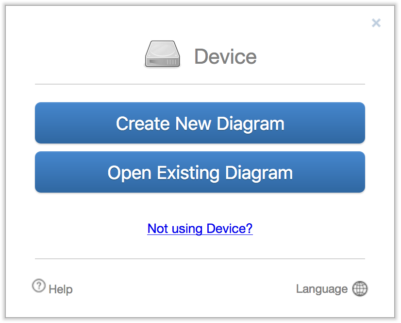
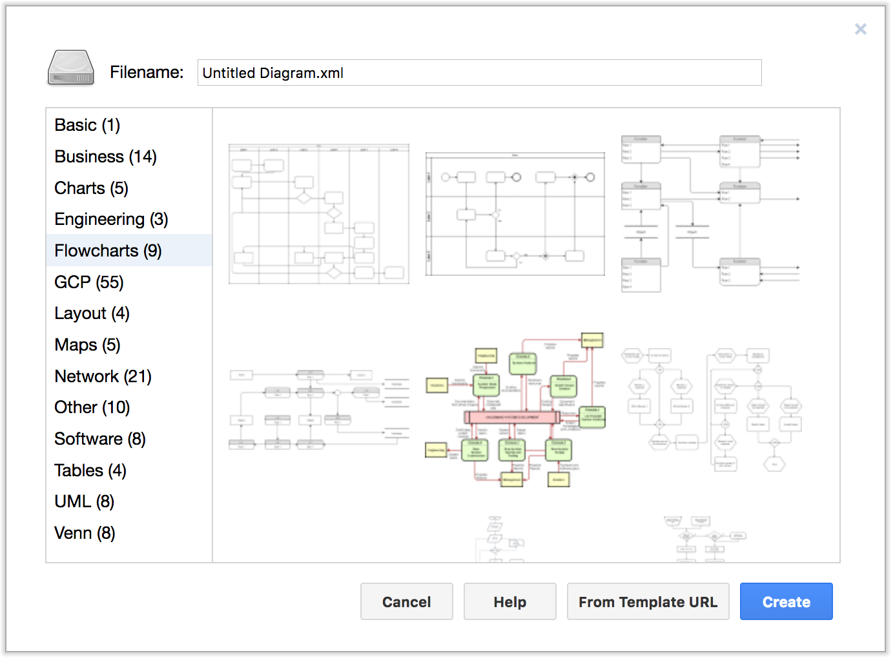
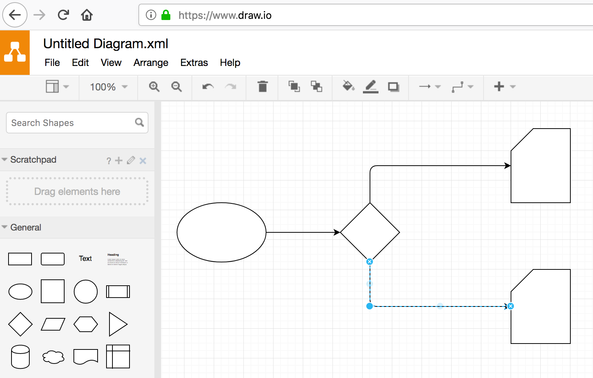
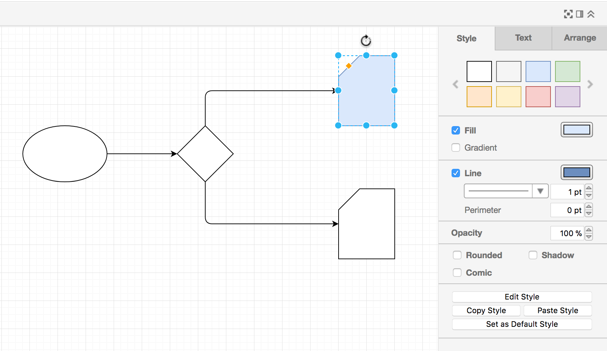
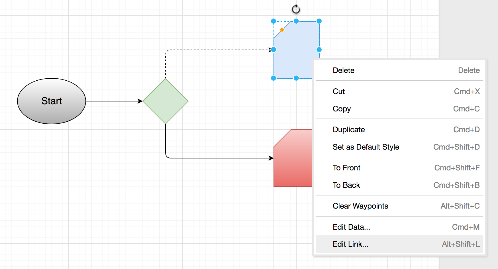
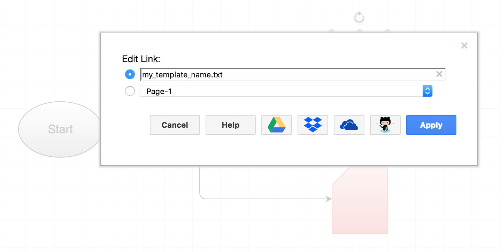
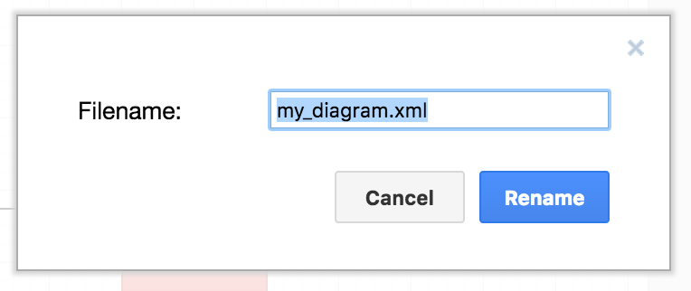
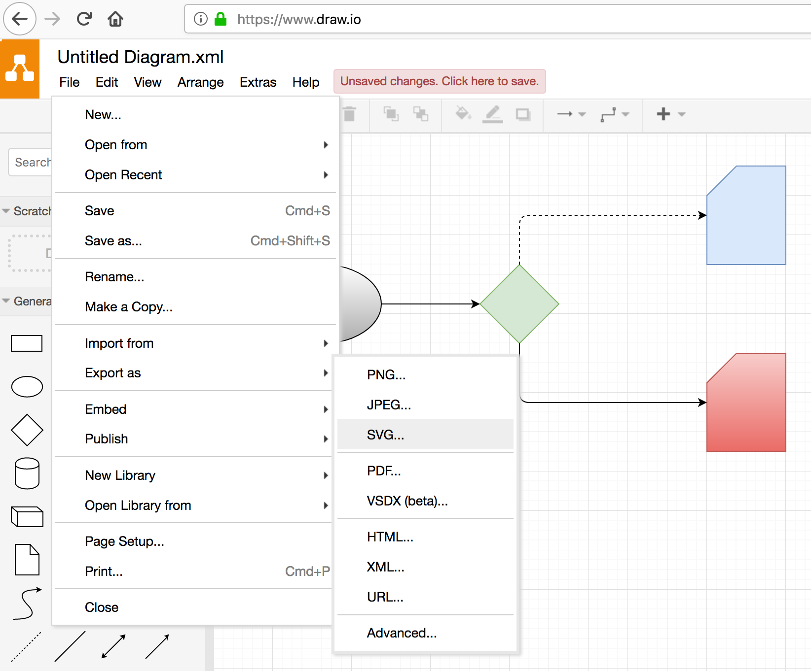
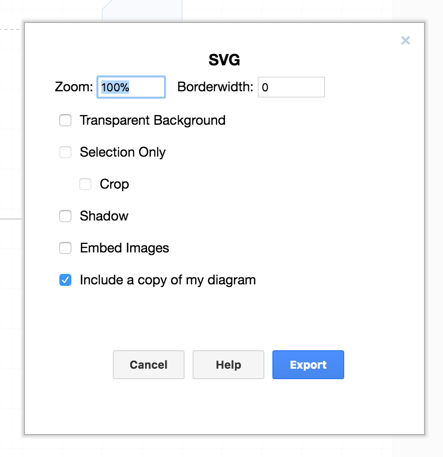
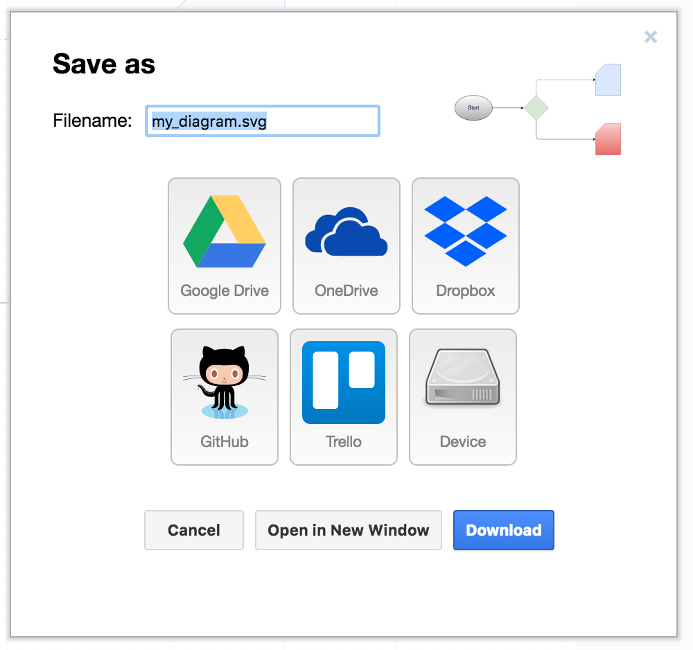

### Creating SVG diagrams with Draw.io

[Draw.io](www.draw.io) is a great online graph editor from JGraph Ltd. It has an intuitive and rich interface to create all kinds of diagrams and flow charts.

Visit [Draw.io](www.draw.io) and select "Create New Diagram" from the splash screen. If you had previously created a draw.io diagram and exported it to a file, you can select "Open Existing Diagram" and upload it again for edition:

Draw.io has a bunch of chart types to choose from. Start with the "Basic" chart.

Drag and drop the shapes on the left panel into the canvas. You can move the shapes and change their size and proportions.

Select a shape and use the tools on the right panel to change styles, arrangement and text.

In order to add the link to the template, right click on a shape and select "Edit Link...".

Add the name of the TXT, CSV or XML template you would like to link to this shape. **Only the name**, no need for the full path to the template. When done click on "Apply".

(see also: [Supported Link Types](#Supported-Link-Types) section)

At any point in time you can rename your diagram, in order to do so click on **File -> Rename** and edit the filename. Leave the .xml extension, for now.

Once your diagram is ready you need to export it to SVG. In order to do so click on **File -> Export -> SVG**.

Click on "Export."

And then "Download" to get the SVG file into your local filesystem.

