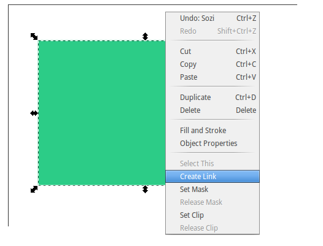

### Creating SVG diagrams with Inkscape

Perhaps a bit more complex to learn than Visio, but quite powerful, fully equiped with vector graphic manipulation tools.

Select a shape from the bar on the left, for example the rectangle, and draw a shape. Right click on the shape and select "Create link"

A file attributes box will pop up on the right side. In the field "Href" write the name of the TXT, CSV or XML template file you want to link. Remember to write only the name of the template, no need for the full path.

> **Important**: Filenames must be **unique** per model. Graphyte will crawl through all the input files looking for every linked filename until it finds the first match.

In order to add another shape just repeat the steps again. You can add hyperlinks to virtually any element you add to the Inkscape canvas, the options are endless.

When your diagram is ready, click on **Archive -> Save as** and choose the name of your SVG file. Remember that this will later become the name of the module, and that the file must keep its **.svg** extension.

(see also: [Supported Link Types](#Supported-Link-Types) section)

