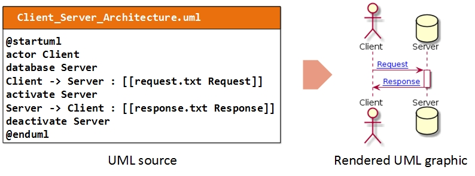

## UML Diagrams

Graphyte implements support for UML specification files by leveraging the great [PlantUML tool](http://plantuml.com/). PlantUML is widely used in IT for a variety of applications, from creating live diagrams while extracting requirements from a customer, to creating specifications for a design, representations of software components or creating charts of any kind.

At the time of this writing, the following UML diagrams are supported by PlantUML:

- [Sequence diagram](http://plantuml.com/sequence-diagram)
- [Usecase diagram](http://plantuml.com/use-case-diagram)
- [Class diagram](http://plantuml.com/class-diagram)
- [Activity diagram](http://plantuml.com/activity-diagram-beta)
- [Component diagram](http://plantuml.com/component-diagram)
- [State diagram](http://plantuml.com/state-diagram)
- [Object diagram](http://plantuml.com/object-diagram)
- [Deployment diagram](http://plantuml.com/deployment-diagram)
- [Timing diagram](http://plantuml.com/timing-diagram)

On each of the links above, the PlantUML folks guide you through the creation of each type of diagram. It´s worth taking a look at the possibilities.

Once you have your first UML specification ready, you can test it online on [PlantUML Web Server](http://www.plantuml.com/plantuml). Or, if you prefer, you can [download PlantUML](http://plantuml.com/download) and work offline.

### Creating UML diagrams for Graphyte

Use the plain text editor of your choice to create the UML file with your diagram's specification, following the guides on [PlantUML website](http://plantuml.com/).

In order to link an element of your diagram to a specific input template, follow the format described in [Using Hyperlinks with PlantUML](http://plantuml.com/link). 

In the following example, graphyte will load the user created template **request.txt** in the viewer area when clicking on the "Request" text, and will load the template **response.txt** when it detects a click on the "Response" text in the diagram.

(see also: [Supported Link Types](#Supported-Link-Types) section)

Choose the name of your UML file carefully, it will later become the name of the module. The file must keep its .uml extension.

