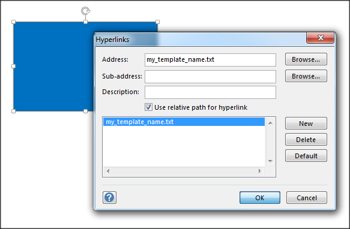

### Creating SVG diagrams with Microsoft Visio

This might be the most familiar solution in many cases, since it comes with simple to use stencil collections for any kind of diagram, which can also be extended downloading new stencils from online sources.

Open Visio and draw any shape or stencil you like. For example in the top Ribbon - Tools select the rectangle and draw a rectangle in your canvas.

Right-click on your shape and select "Hyperlink...".

Edit the field "Address:" and add the name of the TXT, CSV or XML template you would like to link to this shape. **Only the filename** is required, no need for the full path to the template. When done click OK.

Repeat the steps above until your diagram is ready.

(see also: [Supported Link Types](#Supported-Link-Types) section)

In order to export the diagram to SVG from Visio click on **File -> Export -> Change File Type -> SVG** and choose the name of your SVG file. This will become the name of the module. The file must keep its **.svg** extension.

> **Important**: Filenames must be **unique** per model. Graphyte will crawl through all the input files looking for every linked filename until it finds the first match.
