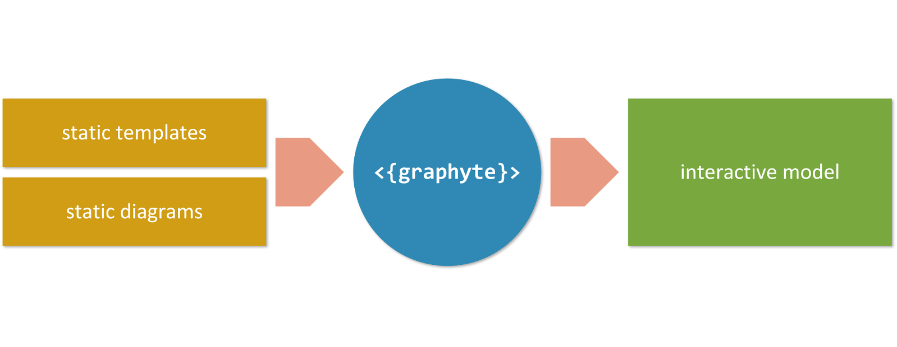
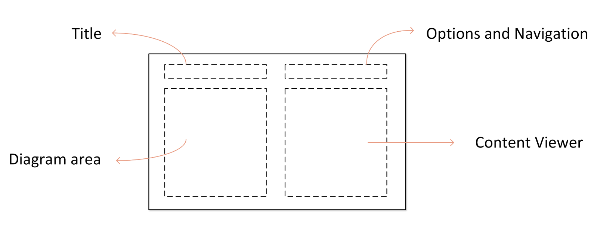
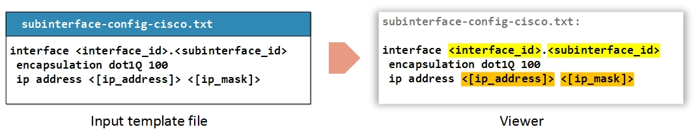
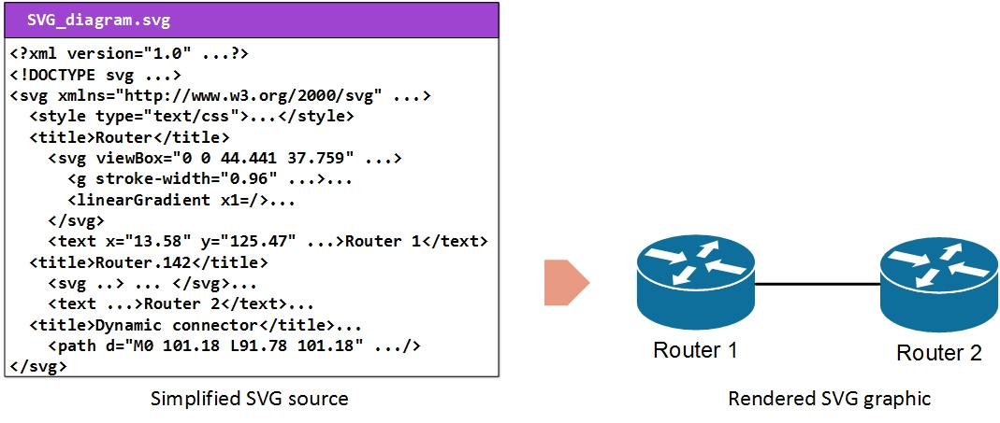
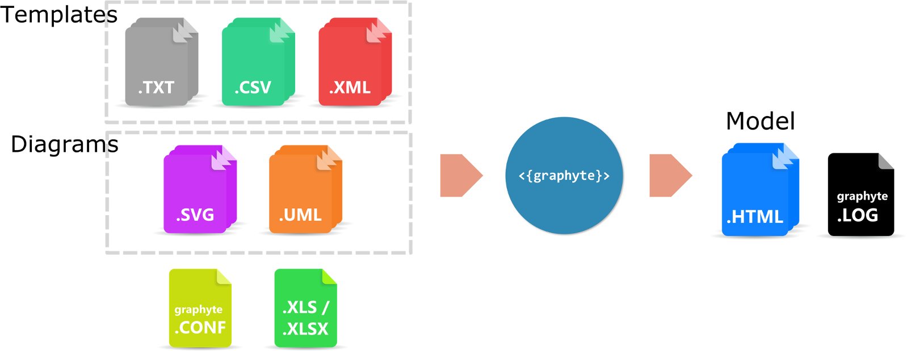

# Introduction

Graphyte is a general-purpose webdoc automation engine that supports the full project lifecycle (requirement capture, revision, design, development, Q&A, documentation). It helps automate the creation of interactive, portable web documents that massively reduce the size and complexity of traditional documentation.

Features:

- Generation of dynamic web documentation.
- Interactive visualization of configuration and text files.
- Markup syntax for highlighting parameters in TXT, XML files.
- Support for diagrams in SVG format and in UML language.
- Version control.
- Integrated text editor for template review.
- Parameter extraction and validation.
- Minimum overhead per new revision of the documentation.

As a general purpose documentation tool, the range of possible applications is unlimited:

- Cisco NSO project requirements / versioning / validation / design / reference.
- Network designs/LLD documents with device configurations.
- Interactive presentations
- Flow/Sequence/Component diagrams with supporting documents.
- Review of design specifications maintaining version control.
- etc

# Models and Modules

Graphyte requires a set of input files from the user. In turn, it generates and validates a standalone web based set of documents known as the graphyte **model**.

A model is a set of web documents that are related to each other, and combined create the full representation of the target design the user is trying to build. It could be a series of network schematics with device configurations, a sequence diagram with extended information, a logic workflow and parametrized templates for an automation project, or your new flat's blueprints and notes.

Each one of the HTML web documents that assemble the model is referred to as a graphyte **module**. A model may consist of one or more modules. The web page layout of a module has the following structure:

## Input Files

In order to generate a model using Graphyte, the user needs to prepare a series of source files to be passed as inputs:

- **Templates**: These are text files with content that will show up in the viewer when triggered by mouse clicks on the diagram. The currently supported formats are Plain Text files (**.txt**), eXtensible Markup Language XML files (**.xml**) and Comma Separated Values files (**.csv**).
- **Diagrams**: The diagram files used with graphyte are also text-based. Currently supported formats are Unified Modeling Language UML (**.uml**) and Scalable Vector Graphics files (**.svg**). UML file support is achieved by graphyte via integration with the **PlantUML** tool. SVG is an XML-based image format for two-dimensional graphics. A variety of applications allow creating or exporting to SVG files, including Inkscape or Microsoft Visio.
- **Variable List**: Optionally, depending on which graphyte features the user is aiming for, additional input files may be needed. This is the case for example for input files with parameters, that graphyte can automatically validate against a user defined list of allowed model parameters.
- **graphyte.conf file**: The user is required to include a small configuration file where a series of options can be set, including the name and version of the model.

#### Templates

The ultimate objective of a model is to represent relevant information in the viewer area responding to user events (mouse clicks) on the different parts of the diagram.

This relevant information is provided to graphyte in the form of text files called **templates**.

Templates may optionally include parameters. Graphyte provides syntax capabilities to support up to 4 types of parameters that will be detected, processed and highlighted as such.

The section [Creating Templates](templates.md) has all the details on how to create graphyte templates.

#### Diagrams

Graphyte diagrams allow the model designer to represent large amounts of information in a usable and condensed way.

Graphyte supports three types of input diagrams:

- **SVG**: Scalable Vector Graphics files (with extension **.svg**).
- **UML**: Unified Modeling Language UML files (with extension **.uml**)
- **YANG**: YANG modeling languaje files (with extension **.yang**)

Both are processed and embedded into the HTML modules as SVG objects (UML diagrams are internally converted to SVG). SVG files are text-based specifications of two-dimensional graphics, written following an XML-based structure. Rendering of most SVG graphics is supported by the majority of mainstream modern browsers (**W3C**). Other advanced features present in complex SVG elements, like for example **foreign-object** elements are not currently supported in the HTML5 `<svg>` element. Test HTML support for your diagrams passing them to the graphyte tool.

Both types of diagram specifications are text-based and require a rendering engine to create the resulting graphics. Below are a couple of examples of the source text file and the rendered version:

Within the diagram, the model designer will **link** shapes or elements to target templates. By doing this, the shape becomes responsive to mouse clicks that will load the target template into the **viewer**.

The creation of SVG graphics is usually achieved by using a graphic editor. One can simply draw lines and shapes and once ready export the work to an SVG file. We will explain how to do this using several well-known editors:

- [Visio](https://en.wikipedia.org/wiki/Microsoft_Visio), a widely used software from Microsoft.
- [Draw.io](https://www.draw.io/), an online flowchart editor.
- [Inkscape](https://inkscape.org/), a free vector graphics editor.

The following sections provide the necessary details for creating graphyte-ready SVG/UML diagrams.

- [Creating SVG diagrams with Microsoft Visio](diagrams_visio.md)
- [Creating SVG diagrams with Draw.io](diagrams_drawio.md)
- [Creating SVG diagrams with Inkscape](diagrams_inkscape.md)
- [Creating UML diagrams for Graphyte](diagrams_uml.md)
- [Rendering YANG diagrams with Graphyte](diagrams_yang.md)

#### Variable List

As previously mentioned, graphyte templates may include variables, which are marked using a specific available syntax.

Optionally, the model designer may choose to perform automatic validation of template variables against a pre-defined input list, provided in **.xls**/**.xlsx** sheet format. This will help ensure that all variables used in templates are known and valid.

Visit the [Variable List section](variables.md) section for details on how to create the variables worksheet.

#### Configuration File

Finally, graphyte requires a configuration file that will contain the details of the model such as name and version, as well as other optional fields. The **graphyte.conf** file is mandatory and must be unique.

Find the details for the creation of graphyte.conf file on [Configuration File section](configfile.md).

## Output Files

Once the input files are ready, the model owner is ready to run graphyte (see [Running Graphyte](running.md) section for details).

As a result, the model, consisting on one or more HTML modules, will be generated. Details on the resulting files can be found on the section [Graphyte Output Files: The Model](output_files.md).

