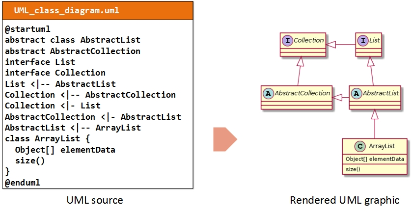
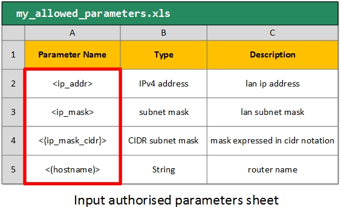

# Introduction

Graphyte is a general-purpose webdoc automation engine that supports the full project lifecycle (requirement capture, revision, design, development, Q&A, documentation). It helps automate the creation of interactive, portable web documents that massively reduce the size and complexity of traditional documentation.

Features:

- Generation of dynamic web documentation.
- Interactive visualization of configuration and text files.
- Markup syntax for highlighting parameters in TXT, XML files.
- Support for diagrams in SVG format and in UML language.
- Version control.
- Integrated text editor for template review.
- Parameter extraction and validation.
- Minimum overhead per new revision of the documentation.

As a general purpose documentation tool, the range of possible applications is unlimited:

- Cisco NSO project requirements / versioning / validation / design / reference.
- Network designs/LLD documents with device configurations.
- Interactive presentations
- Flow/Sequence/Component diagrams with supporting documents.
- Review of design specifications maintaining version control.
- etc

## Main Concepts

Graphyte requires a set of input files from the user. In turn, it generates and validates a standalone web based set of documents known as the graphyte **model**.


A model is a set of web documents that are related to each other, and combined create the full representation of the target design the user is trying to build. It could be a series of network schematics with device configurations, a sequence diagram with extended information, a logic workflow and parametrized templates for an automation project, or your new flat's blueprints and notes.

Each one of the HTML web documents that assemble the model is referred to as a graphyte **module**. A model may consist of one or more modules. The web page layout of a module has the following structure:


## Using graphyte step-by-step

1. Create your **template files** (.txt, .csv, .xml).
2. Create your **diagrams** (.svg, .uml).
3. **Link** diagram elements to their corresponding template.
4. (Optional) If parameter validation is desired, create your list of **authorized parameters** (.xls/.xlsx).
5. Create your **graphyte.conf** file.
6. Run graphyte. Your model is generated.

Verification and revision:

7. Verify execution log on graphyte.log file.
8. Review your generated model. Modify any templates using the text editor integrated in the viewer.
9. Generate new revisions of the model by updating the version number in the graphyte.conf file.


## Input Files

To generate a model, the user is required to provide a series of input files:

- **Templates**: These are basically text files with content that will show up in the viewer when triggered by mouse clicks on the diagram. The currently supported formats are Plain Text files (**.txt**), eXtensible Markup Language XML files (**.xml**) and Comma Separated Values files (**.csv**).
- **Diagrams**: The diagram files used with graphyte are also text-based. Currently supported formats are Unified Modeling Language UML (**.uml**) and Scalable Vector Graphics files (**.svg**). UML file support is achieved by graphyte via integration with the **PlantUML** tool. SVG is an XML-based image format for two-dimensional graphics. A variety of applications allow creating or exporting to SVG files, including Inkscape or Microsoft Visio.
- **Variable list**: Optionally, depending on which graphyte features the user is aiming for, additional input files may be needed. This is the case for example for input files with parameters, that graphyte can automatically validate against a user defined list of allowed model parameters.
- **graphyte.conf file**: The user is required to include a small configuration file where a series of options can be set, including the name and version of the model.

### Templates


The ultimate objective of a model is to represent relevant information in the viewer area responding to user events (mouse clicks) on the different parts of the diagram.

This relevant information is provided to graphyte in the form of text files called **templates**.

Templates may optionally include parameters. Graphyte provides syntax capabilities to support up to 4 types of parameters that will be recognized, processed and highlighted as such.

Take a look at the [Templates section](templates.md) for details on how to create graphyte templates.

### Diagrams

Graphyte diagrams allow the model designer to represent large amounts of information in a user-friendly and condensed way.

Graphyte diagrams are embedded into the HTML modules as SVG objects. Graphyte accepts as inputs either SVG diagrams, or UML diagrams that it will convert to SVG during execution.

Within the diagram, the model designer will **link** shapes or elements to target templates. By doing this, the shape becomes responsive to mouse clicks that will load the target template into the **viewer**.

The [Diagrams section](diagrams.md) provides more details on how to create graphyte-ready diagrams using several widely available tools.

---...

Graphyte supports two types of input diagrams:

- **SVG**: Scalable Vector Graphics files (with extension **.svg**).
- **UML**: Unified Modeling Language UML files (with extension **.uml**)

Both types of diagram specifications are text-based and require a rendering engine to create the resulting graphics. Below are a couple of examples of the source text file and the rendered version for both types of diagrams:





...

SVG files are text-based specifications of two-dimensional graphics, written following an XML-based structure. Rendering of most SVG graphics is supported by the majority of mainstream modern browsers (**W3C**). Other advanced features present in complex SVG elements, like for example "foreign-object" elements are not supported in the HTML5 <svg> element. Test HTML support for your diagrams passing them to the graphyte tool.

The creation of SVG graphics is usually achieved by using a graphic editor. One can simply draw lines and shapes and once ready export the work to an SVG file. We will explain how to do this using several editors widely known and used:

- [Visio](https://en.wikipedia.org/wiki/Microsoft_Visio), a widely used software from Microsoft.
- [Draw.io](https://www.draw.io/), an online flowchart editor.
- [Inkscape](https://inkscape.org/), a free vector graphics editor.

In these sections we will first create a simple shape, then add the link for a hypothetical template file, and lastly export to SVG format, compatible with graphyte. Creating a model will come down to repeat the procedure for each shape/template of each diagram.


### Variable List

As seen in the [Templates chapter](templates.md), graphyte templates may include variables, which are marked using a specific available syntax.

Optionally, the model designer may choose to perform automatic validation of template variables against a pre-defined input list, provided in .xls/.xlsx sheet format. This will help ensure that all variables used in templates are known and valid.

Check out the [Variable List section](variables.md) for details on how to create the variables worksheet.



### Configuration File

Finally, graphyte requires a configuration file that will contain the details of the model such as name and version, as well as other optional fields. The **graphyte.conf** file is mandatory and must be unique.

Find the details for graphyte.conf creation on [Configuration File section](configfile.md).

## Running Graphyte

Once the model owner has created templates and diagrams, linked them together, created the graphyte.conf file and optionally the variable worksheet, everything is ready to generate the graphyte model.

Place all the input files under the same directory. The directory path containing all input files will be passed as argument to graphyte with -d option.

```
python3 graphyte.py -d /path/to/inputs/directory/
```

Note that there are no restrictions as to how input files should be organized below the directory specified with -d option. Graphyte will scan all subdirectories and fetch the relevant files required by the model.

## Output Files

As a result of running graphyte successfully, graphyte will generate one **.html module** for each diagram input file, as well as the **graphyte.log** file containing execution information.

The output files will be placed in a **/www** folder below the directory passed with -d option.

### HTML Modules

Graphyte will generate an HTML file for each of the modules that form the model. Apart from the diagram and the viewer area, the following fields are found:

- **Title**: Formed by the name and version of the model (specified in graphyte.conf file), and the module name (extracted from the diagram file).
- **Zoom tool**: Allows zooming the diagram in and out for better visualization.
- **Module Parameters**: if the parameter analysis was performed as part of graphyte's execution, the results will show up here.
- **Navigation menu**, displaying all the available modules (HTML pages) and providing a way to jump from one to the other from within the browser. Navigation links are relative, so the HTML files must be in the same folder for them to work.
- **Text editor**: Templates can be edited from within the viewer using the integrated editor. After making the changes on the plain text document, the reviewer can download the modified file to his system. The template embedded in the current model will not be updated, the model is frozen on a fixed version. In order to incorporate the revised template, a new model version will need to be generated.


### Log file

The log file contains execution details useful for information and troubleshooting.