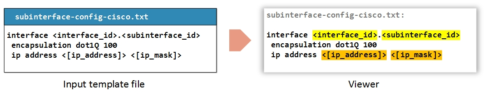
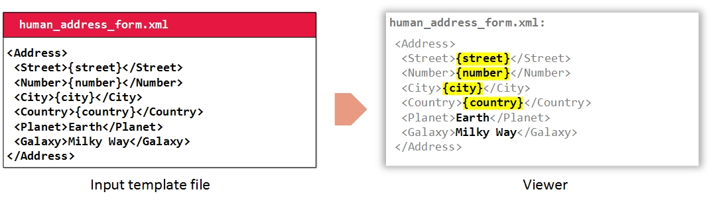

# Templates

The ultimate objective of a model is to represent relevant information in the viewer area responding to user events (mouse clicks) on the different parts of the diagram.

This relevant information is provided to graphyte in the form of text files called **templates**.

Templates may optionally include parameters. Graphyte provides syntax capabilities to support up to 4 types of parameters that will be recognized, processed and highlighted as such.

Take a look at the [Templates section](templates.md) for details on how to create graphyte templates.

## TXT Templates

Any plain text content to be displayed in the viewer can be added as a file with **.txt** extension.

TXT templates may use variables if desired. When displayed in the viewer (after the user clicks on the associated diagram section) the variables are highlighted for readability.

## Variables in TXT Templates

Graphyte supports variable markup syntax based on text bracketing, that allows it to recognize up to 4 different types of variables in the plain text files, process and validate them, and color highlight them in the viewer in real time.

The following variable syntax markers are available for **.txt** files:
 
- **Type 1** variables: `<variable_name>`
- **Type 2** variables: `<{variable_name}>`
- **Type 3** variables: `<(variable_name)>`
- **Type 4** variables: `<[variable_name]>`

It is up to the graphyte user to decide the specific role that each of the variable types above will play in the model. Some models will require several categories for different types of variables, others might only require a single type, and some models might not even require parametrized templates at all. There is full flexibility on this regard.

When the template is loaded in the viewer, the variables are rendered for better readability. Different markers (variable types) are highlighted in different colors.

Say, for instance, the user would like to add to the model a template for a subinterface configuration, leaving some of the configuration data as input variables. The model owner will assign a different type to each variable choosing among the available markers in a way that makes sense for the model. For example '**< >**' (**Type 1**) for input variables, and '**<[ ]>**' (**Type 4**) for variables that need to be looked up on some database. Graphyte will spot and process those variables and the viewer will highlight them according to their markup.

Parameter names must follow some rules:

- May not contain spaces or newlines.
- May only contain markup characters in external marker '< > { } ( ) [ ]'. (E.g.: `<na{m}e>` is not a valid variable name, while `<{name}>` is).
- The standard recommendation is to use **letters [a-zA-Z]**, **numbers [0-9]** and **underscores '_'**.

## CSV Templates

Comma Separated Values (**.csv**) files are used to represent tables.

CSV files can be created on any plain text editor. New rows are depicted by the newline or carriage return character, and cells within a row are separated by the character '**,**'. The filename must have the extension .csv for graphyte to recognize it as a CSV input file, and represent it as a table when loaded in the viewer.

## Variables in CSV Templates

The same considerations as for variables in TXT files apply for CSV files. Syntax will be highlighted and the same kind of parameter processing will be performed.

In this example, the user has included two types of parameters, marked with '**< >**' (**Type 1**) and '**<{ }>**' (**Type 2**). Perhaps the model owner has defined that type 1 parameters (yellow) will mean "input parameters" in his model, and type 2 parameters (blue) are those that can be calculated based on others (derived) and therefore are not needed as inputs.

## XML Templates

XML template files are passed to graphyte as input files with the extension **.xml**. When displayed in the viewer, graphyte performs a basic highlighting differentiating the text that is part of the XML markup (inside '< >' tags) and the text that is part of the XML data content, also known as "character data".

## Variables in XML Templates

The syntax used to specify parameters on XML files differs from the one used for TXT or CSV on the fact that it uses a simple brace bracketing '**{ }**' markup. Parameters on XML files are not validated and are highlighted in yellow as follows.

In the example above some of the character data fields include parameters that are highlighted in the viewer, while others have fixed values. A character data field may combine fixed parts and parameters at the same time.