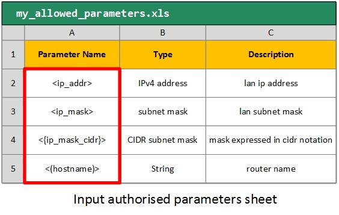

# Variable List

As seen in previous sections, parameters in TXT and CSV input templates are marked with '**< >**' (type 1), '**<{ }>**' (type 2), '**<( )>**' (type 3) and '**<[ ]>**' (type 4).

These markers have two functions. The first of them has already been explained and has to do with highlighting the parameter in the viewer with a color according to its type.

Optionally, graphyte can perform a parameter revision while generating the model. The process is the following:

- The user provides an input sheet (XLS/XLSX) along with the rest of input documents (templates, diagrams, etc).
- The first row is reserved for headers. On the first column, the user includes a list of **authorized parameters** in the model. The rest of the columns may contain information or not.
- While generating the model, graphyte will analyze all the parameters on each of the input templates, and check them against the authorized parameters.
- On each module, graphyte will include a section **"Module parameters"**, where the results of the analysis are displayed as a table. If any non-authorised parameters were found in any template used by the module, they will be marked as such in the table, and an alert sign will show up: "**Module Parameters ( ! )**".

Every variable found in TXT and CSV templates will be checked against the variables in this sheet (marked in red in the example).

> **Important**: Variables must be added to the worksheet with their correct markers ('**< >**', '**<{ }>**', '**<( )>**', '**<[ ]>**') in order for graphyte to match them correctly.

